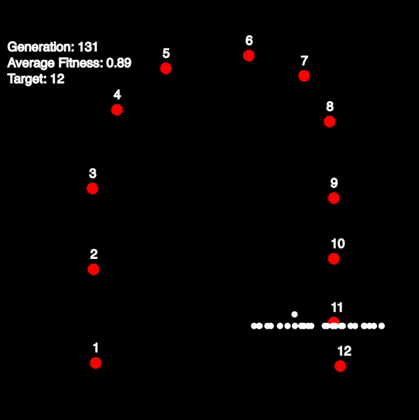

# Evolution-simulation

Simulation of a genetic algorithm written using the P5 library. Targets can be placed on the canvas, and the organisms will follow the targets along a path. This program uses a genetic algorithm to find the path from the first target to the last in the chain.

Link to the simulation can be found [here.](https://zimehrabbasi.github.io/Evolution-simulation/)

## Result

  
## Acknowledgements

 - [Luke Garrigan](https://dev.to/lukegarrigan/genetic-algorithms-in-javascript-mc3)
    Evolution-simulation is an extension of this project on genetic algorithms

  
## License

[MIT](https://choosealicense.com/licenses/mit/)

  
